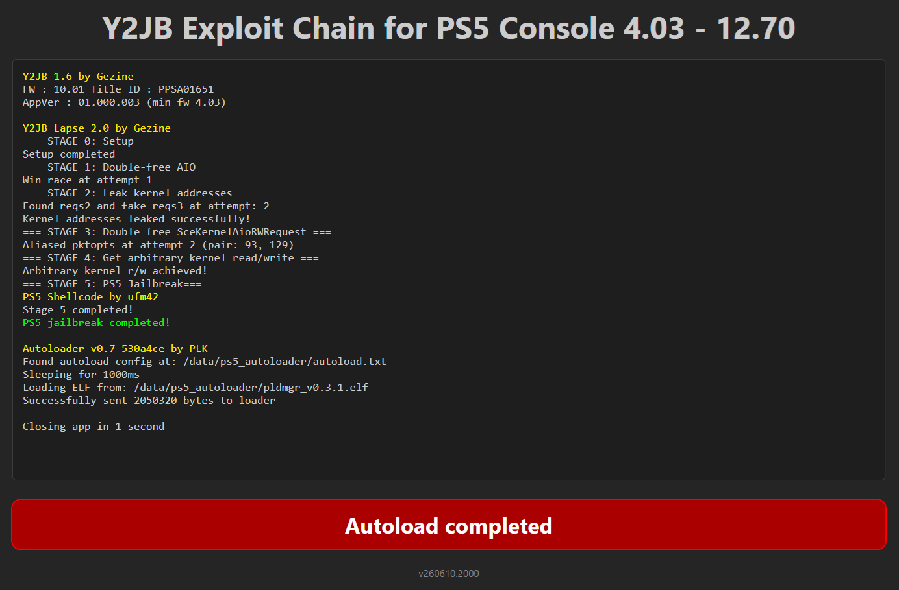
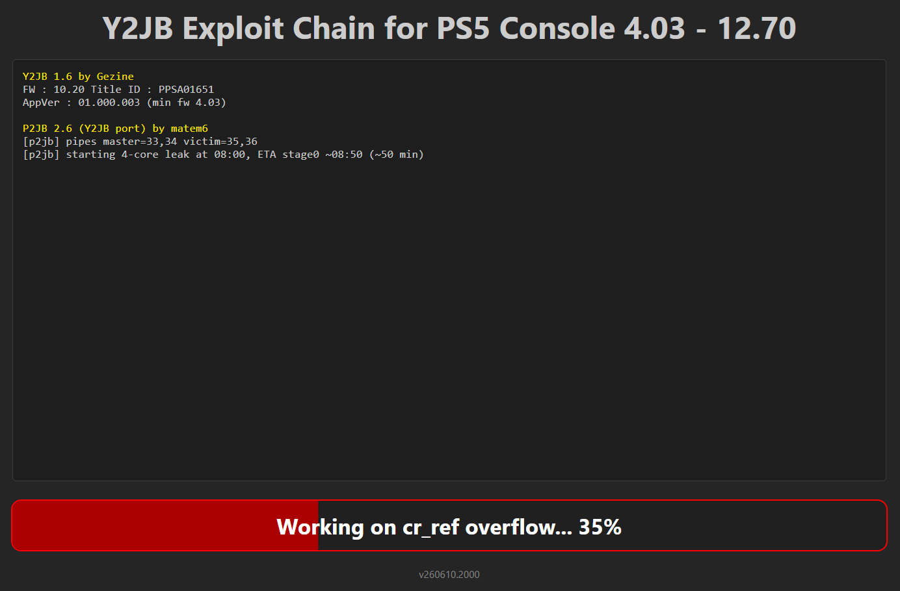
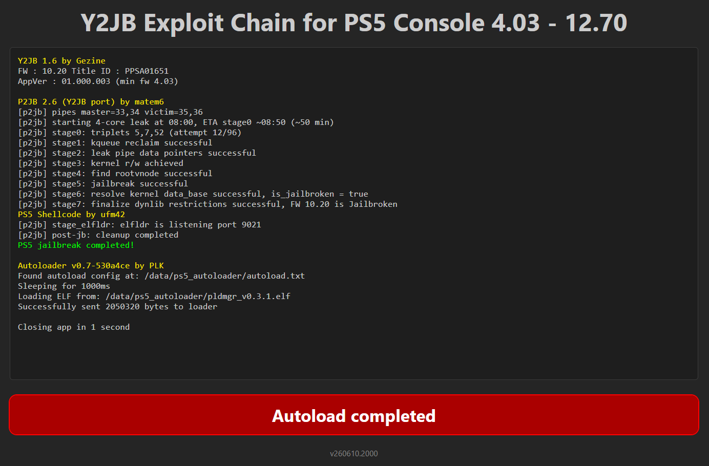

 

<h1 align="center">PS5 Y2JB Autoloader</h1>
<h3 align="center">Fork of <a href="https://github.com/Gezine/Y2JB">Y2JB</a> & <a href="https://github.com/itsPLK/ps5-y2jb-autoloader">Y2JB Autoloader</a></h3>
&nbsp;

Automatically loads the kernel exploit, elf_loader, your elf payloads and .js scripts Supports PS5 firmwares 4.03-12.70

<h4 align="center">⚠️ This repository is for research and educational purposes only</h4>

🚧 Beta / Work in Progress

⚠️ This project is still under active development and beta testing. Firmware-specific issues may occur.

## Overview
This repository is a research-focused fork of Y2JB & Y2JB Autoloader that aims to improve the reliability and success rate of existing public exploit code.

 Lapse Exploit

---

## **Legal Notice & Disclaimer:**

- Jailbreaking, circumventing security, or deploying exploits may be illegal in some jurisdictions.
- It is your responsibility to ensure compliance with local laws.
- The developer assumes **no responsibility** for any potential damage, data loss, or issues that may occur on your PlayStation console as a result of using this repository.
- Use it at your own risk and only on your own devices.

## Major Changes

- **Removed debugging logs** — cleaned up and commented out debugging logs to reduce side effects and improve runtime consistency. Note that this optimization only applies to standard "success path" messages; all warnings, errors, and other critical diagnostic logs remain fully intact and active.
- **Firmware 10.01 and below status** — retained identical core logic for the Lapse software on versions ≤ 10.01, with modifications limited strictly to log optimizations. Expect a similar exploit success rate as before.
- **Background image** — Background image support has been added. Rename your preferred image to **bg.jpg** and replace the existing in the download0.dat file.
- **UI structure refactoring** — moved static UI elements from `main.js` into the HTML template, simplifying the initialization flow.
- **Log transmission refactoring** — removed redundant network transmission logic for the LOG_SERVER configuration in Y2JB code. This change optimization lowers the pipe quantity and expanding the P2JB exploit's stability.
- **P2JB progress indicator** — implemented periodic progress updates during the `cr_ref` overflow phase, allowing the estimated completion percentage to be monitored through the progress bar.
- **Optimized** `download0.dat` **generation** — refactored the GitHub Actions workflow for building the PS5 UFS2 download0.dat file. This adjustment optimizes the compression flow, reducing the final compressed file size to approximately 1.5MB, making it significantly easier to share, store, and download over the internet.

 cr_ref Overflow Stage

 P2JB Exploit

## Optimization & Success Rate Guidelines (User Tips)

To achieve the maximum success rate with the **P2JB** exploit, please pay close attention to the following runtime behaviors observed during development and testing:

- **Keep Pipe Counts Low (Target: ≤ 34)** — The exploit's stability is highly dependent on system pipe structures. Keeping the pipe count at **33** yields the best results. A pipe count of 34 still offers a high success rate, but crossing above 34 will drastically degrade performance. 
  - *Recommendation:* Network log removal optimization helps keep this value at 34. If you face instability, consider disabling network connections entirely during the initial exploit stage and re-enabling them only after the jailbreak completes successfully.
- **Ensure Uninterrupted Execution** — The P2JB process is highly sensitive to background interruptions. Actions that trigger OS notifications or app state switches will significantly lower the success rate.
  - *Recommendation:* Avoid background events during the process. Do not disconnect/reconnect networks, minimize the YouTube app, or trigger system popups until the exploit sequence is fully finished.
- **Backup & Testing Strategy (Highly Recommended)** — Before testing this repository, it is strongly advised to maintain a working backup exploit on your console. If you already have a stable, working exploit installed on the **US version** of the YouTube app, you can safely install and test this repository on the **EU or JP versions** of the app. This approach ensures your primary setup remains functional while you test these optimizations.

## ToDo List

- Change color of error & warning messages Red & Orange

## Notes:

> Firmware 4.03 – 10.01 uses Lapse, 10.20 - 12.70 uses P2JB for Jailbreak.

> No modifications that alter the exploit logic in ways affecting device security outside test context.

> Y2JB v1.6, Lapse v2.0, P2JB v2.6 and Autoloader v0.7 are used.

## How to Use

There are two ways to use the autoloader:

### 🟢 Option 1: Payload Manager

If no `autoload.txt` config is found, the autoloader will automatically launch **[Payload Manager](https://github.com/itsPLK/ps5-payload-manager)** — a fully-featured PS5 payload manager with a web UI. This lets you configure and send payloads directly from your browser, without needing to manually set up config files or transfer ELF files ahead of time.

Just run the autoloader — if there's nothing configured, Payload Manager starts automatically.

> **Note:** Payload Manager also has its own built-in autoload feature, which lets you configure payloads to load automatically on startup — all managed through its web UI. This is separate from the `autoload.txt` mechanism described below.

---

### ⚙️ Option 2: Manual Config (`autoload.txt`)

For a fixed, automated payload chain, you can configure payloads manually:

- Create a directory named `ps5_autoloader`.
- Inside this directory, place your `.elf` / `.bin` files, and an `autoload.txt` file.
  - In `autoload.txt`, list the files you want to load, one filename per line.
  - Filenames are case-sensitive — ensure each name exactly matches the file.
  - You can add lines like `!1000` to make the loader wait 1000 ms before sending the next payload.
- Put the `ps5_autoloader` directory in one of these locations (priority order - highest first):
  - Root of a USB drive
  - Internal drive: `/data/ps5_autoloader`

> **Note:** When an `autoload.txt` config is found, Payload Manager is **not** launched automatically. If you also want Payload Manager available, place `pldmgr.elf` in your `ps5_autoloader` directory and add it to `autoload.txt`.

## Setup Instructions

Installation is the same as the original [Y2JB](https://github.com/Gezine/Y2JB/blob/main/README.md) (remote loader).

### Jailbroken PS5 (Webkit, Lua, BD-JB)
- Install the correct YouTube version for your firmware:
  - For firmware **4.03 to 12.40** get YouTube app (PPSA01650) version **01.000.003** PKG
  - For firmware **12.60 and up** get YouTube app (PPSA01650) version **01.000.030** PKG
  - *(Note: PPSA01651 and PPSA01652 from different regions also work)*
- Use FTP to place `download0.dat` from releases page in `/user/download/PPSA0165*`

**Recommended Solution:**
The autoloader includes **Payload Manager**. Using it is the most reliable way to load kstuff, as it waits for the YouTube app to close before sending the payloads. To use it, make `pldmgr.elf` the **only** item in your `autoload.txt`.

## Q & A

<i>How to have different autoload configs for multiple YT apps?</i>

If you want to use multiple YT apps from different regions,
name your directory <code>ps5_autoloader_[TITLE_ID]</code>, e.g. <code>ps5_autoloader_PPSA01650</code>
this will allow you to have different autoload.txt files for each app
(these directories always take precedence over the generic ps5_autoloader directory)

## Contributing

Contributions are welcome! Feel free to open pull requests for bug fixes, UI improvements or additional features.

## License

This project is licensed under the **GPL-3.0 License**.

The original **Y2JB** base code remains under its original **MIT License** (see [LICENSE-MIT](LICENSE-MIT)).
All unique modifications and additions in this fork are licensed under **GPL-3.0**.

## Credits

* **[Gezine](https://github.com/Gezine)** - Creator of the original [Y2JB](https://github.com/Gezine/Y2JB)
* **[PLK](https://github.com/itsPLK)** - Creating autoloader for [Y2JB](https://github.com/Gezine/Y2JB)
* **[shahrilnet](https://github.com/shahrilnet), [null_ptr](https://github.com/n0llptr)** - Referenced many codes from [Remote Lua Loader](https://github.com/shahrilnet/remote_lua_loader)
* **[BenNoxXD](https://github.com/BenNoxXD)** - [ClosePlayer](https://github.com/BenNoxXD/PS5-BDJ-HEN-loader) reference
* **[ntfargo](https://github.com/ntfargo)** - Thanks for providing V8 CVEs and CTF writeups
* **abc and psfree team** - Lapse implementation
* **[matem6](https://github.com/matem6)** - [P2JB](https://github.com/matem6/P2JB-Y2JB-Porting) implementation
* **[flat_z](https://github.com/flatz) and [LM](https://github.com/LightningMods)** - Helping implement GPU rw using direct ioctl
* **[john-tornblom](https://github.com/john-tornblom) and [EchoStretch](https://github.com/EchoStretch)** - Providing elfldr.elf payload
* **[hammer-83](https://github.com/hammer-83)** - Various BD-J PS5 exploit references
* **[zecoxao](https://github.com/zecoxao), [idlesauce](https://github.com/idlesauce), and [TheFlow](https://github.com/theofficialflow)** - Helping troubleshoot dlsym
* **[Dr.Yenyen](https://github.com/DrYenyen) and PS5 R&D community** - Testing Y2JB
* **Rush** - Creating Y2JB backup file
* **[ufm42](https://github.com/ufm42)** - [kexp](https://github.com/ufm42/kexp) used for PS5 post JB all-in-one shellcode

## Contact

For questions or issues, please open a GitHub issue on this repository.
